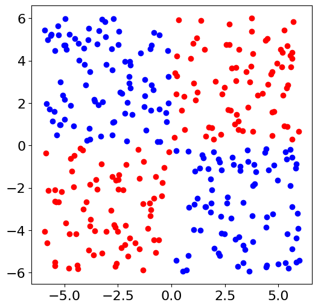
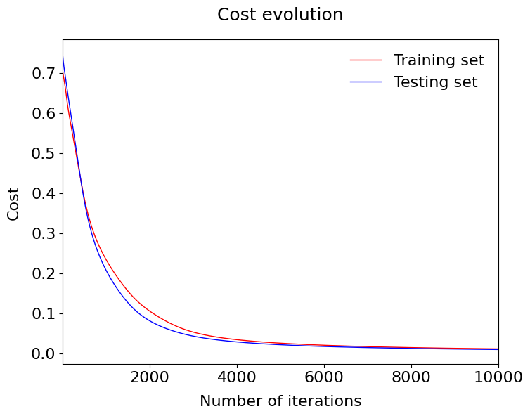
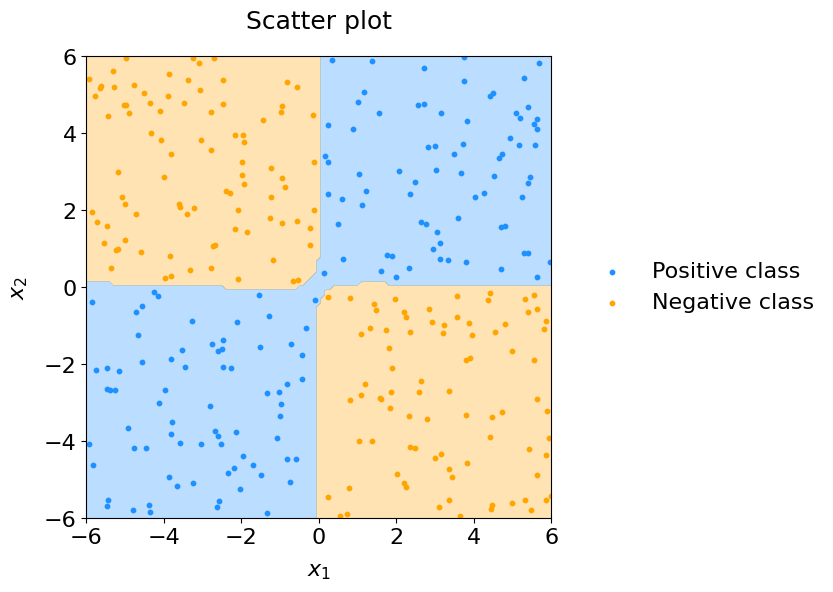

# Neural Network From Scratch

## Overview
This project demonstrates the step-by-step implementation of a neural network from scratch using Python, covering data preparation, core functions, training, and visualization.

---

## Sections
1. **Introduction**: Theoretical background of backpropagation.
2. **Problem Setup**: Description and objectives of the task.
3. **Data Preparation**: Loading and preprocessing data (splitting signal/background, converting to NumPy).
4. **Core Functions**: Implementing weighted sum, activation functions, cross-entropy loss, and derivatives.
5. **Feedforward**: Computing activations and predictions.
6. **Training**: Gradient descent to minimize cost and track performance.
7. **Results**: Cost evolution plot and decision boundary visualization.
8. **Bonus**: Additional experiments and features.

---

## Problem Setup

---

## Results
- **Cost Evolution Plot**:
  
  - Tracks the cost decrease during training, showing the network's learning progress.

- **Decision Boundary Plot**:
  
  - Visualizes the separation of positive and negative classes in the dataset, illustrating the network's classification performance.

---

## Conclusion
The project successfully implements a neural network from scratch, emphasizing the importance of clear training workflows and visual analysis.

